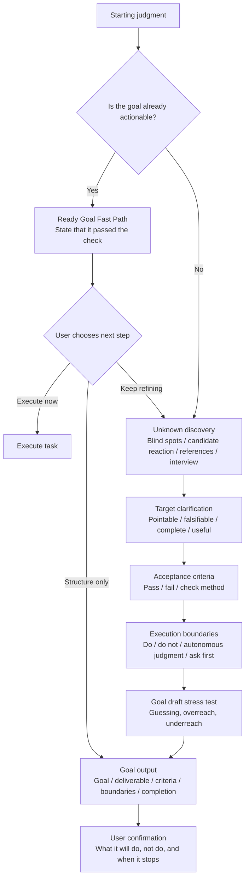

# goal-clarifier

[English README](README.en.md) / [中文说明](README.md)

Turn fuzzy ideas into executable goals for agents.

Works with Codex, Claude Code, and other agent workflows that support `SKILL.md` or system-prompt-style skills.

As models become stronger, the bottleneck is often no longer whether the agent can do the work. The bottleneck is whether the human can clearly express what they want, what counts as done, what should not be done, and when the agent must ask first.

`goal-clarifier` is not a prompt-polishing tool. It is a clarification layer that turns vague intention into an executable, testable, bounded agent goal.

Homepage: [Jasper Wei](https://x.com/Jasper_Wei1)

---

## Installation

### Universal Install for Codex / Claude Code

```bash
npx -y skills add Jasper-Wei1/goal-clarifier -g --all
```

This requires `node` / `npx`.

Use it in Codex:

```text
$goal-clarifier
```

Use it in Claude Code:

```text
/goal-clarifier
```

## Updating

Run the same command again:

```bash
npx -y skills add Jasper-Wei1/goal-clarifier -g --all
```

---

## At a Glance

| Raw expression | After goal-clarifier |
| --- | --- |
| I want an agent to organize my content system, but I do not know what it should produce. | A concrete content-system design goal with layers, workflow states, naming rules, and non-goals. |
| Make this project more professional. | A scoped goal: improve README, installation instructions, and examples without touching core code. |
| I want a product plan, but I do not know what good looks like. | First choose between judgment, execution, sales, or requirements-style plans, then define acceptance criteria. |
| I want to hand this request to Codex. | A structured goal with Goal, Deliverable, Acceptance Criteria, Execution Boundaries, and Completion Definition. |

---

## Core Method

### 1. First check whether the goal is already actionable

If the request already has a target, deliverable, and boundary, the skill does not over-clarify. It states the judgment:

```text
This goal already has a target, deliverable, and boundary. We can skip the full clarification flow.
```

Then it asks:

```text
Do you want me to execute it now, only convert it into a structured goal, or keep refining it?
```

Passing the ready-goal check does not mean automatic execution. The user still confirms the next step.

### 2. If the user cannot state a goal, discover unknowns first

```text
Blind-spot pass: are you missing the target, standard, path, boundary, preference, or field map?
Candidate reaction: show possible directions so the user can say what is closer or clearly wrong.
Reference calibration: show deliverable shapes so the user can recognize what "good" looks like.
Interview: ask only questions that would change the goal structure.
```

### 3. If the user can state a fuzzy goal, audit it

```text
Pointability: what can you point to and say "this is it"?
Falsifiability: what would count as not done?
Completion state: where should the agent stop?
Use context: what will the result be used for?
```

### 4. Output a structured goal

The final goal includes:

- Goal
- Context
- Deliverable
- Acceptance Criteria
- Execution Boundaries
- Non-goals
- Unknown Handling
- Ask Before Doing
- Completion Definition

---

## Workflow

```text
Starting judgment -> Unknown discovery -> Target clarification -> Acceptance criteria -> Execution boundaries -> Goal output
```



---

## Examples

### Example 1: The user only has a fuzzy feeling

```text
$goal-clarifier

I want an agent to organize my content workflow, but I do not know what it should produce.
It just feels messy.
```

The skill starts with unknown discovery:

```text
You may be missing:
A. Target: what final output you want
B. Standard: what good organization looks like
C. Path: whether to diagnose, design, or migrate
D. Boundary: what should not be touched

I will offer candidate directions: diagnosis, architecture, migration, or SOP.
Tell me which is closer and which is clearly not this run.
```

### Example 2: The user has vague quality language

```text
$goal-clarifier

Make this project more professional.
```

The skill turns "professional" into reaction options:

```text
Professional could mean:
A. Code quality: structure, types, tests, error handling
B. Product quality: flows, copy, states, UX
C. Documentation: README, architecture notes, usage guide
D. Release quality: installation, CI, versioning, examples
```

After the user chooses, it becomes checkable acceptance criteria.

### Example 3: The goal is already clear

```text
$goal-clarifier

Using dontbesilent2025/dbskill as a style reference, write a Chinese README for this project. Focus on what the skill solves, installation, and usage examples.
```

The skill states that the goal passed the ready-goal check, then asks:

```text
Do you want me to execute it now, only convert it into a structured goal, or keep refining it?
```

Execution starts only after the user confirms.

---

## What This Skill Is Not For

This skill is mainly a clarification layer before execution. When the goal is clear, use the generated goal with Codex, Claude Code, or another execution agent.

It should not make major decisions for the user. If a choice would change the target, acceptance criteria, or boundary, it asks first.

---

## References

### dbs-goal: idling goal language

Source: [dontbesilent2025/dbskill](https://github.com/dontbesilent2025/dbskill)

`goal-clarifier` keeps the core `dbs-goal` tests:

- pointability
- falsifiability
- completion state

It extends them for agent-goal workflows with acceptance criteria, execution boundaries, non-goals, unknown handling, ask-before-doing rules, and completion definition.

### Claude Fable: Finding your unknowns

Reference: [A field guide to Claude Fable: Finding your unknowns](https://claude.com/blog/a-field-guide-to-claude-fable-finding-your-unknowns)

The key lesson is that users often do not know what they do not know. That is why this skill includes blind-spot passes, candidate reaction, reference calibration, and draft stress testing before final goal output.

---

## File Structure

```text
goal-clarifier/
├── SKILL.md
├── README.md
├── README.en.md
├── LICENSE
└── agents/
    └── openai.yaml
```

---

## License

MIT License. See [LICENSE](LICENSE).
