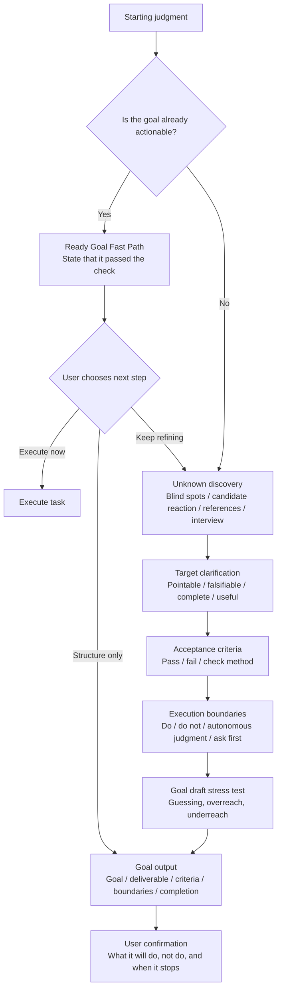

# goal-clarifier

[English README](README.en.md) / [中文说明](README.md)

Turn fuzzy ideas into executable goals for agents.

Works with Codex, Claude Code, and other agent workflows that support `SKILL.md` or system-prompt-style skills.

Homepage: [Jasper Wei](https://x.com/Jasper_Wei1)

As models become stronger, the bottleneck is often no longer whether the agent can do the work. The bottleneck is whether the human can clearly express:

- what they want
- what counts as done
- what should not be done
- where the agent may decide autonomously
- when the agent must ask before proceeding

`goal-clarifier` is not a prompt-polishing tool. It is an interactive clarification layer that turns a vague intention into an executable, testable, bounded agent goal.

---

## At a Glance

| Raw expression | After goal-clarifier |
| --- | --- |
| I want an agent to organize my content system, but I do not know what it should produce. | A concrete "content system design document" with layers, workflow states, naming rules, and non-goals. |
| Make this project more professional. | A scoped goal: improve README, installation instructions, and examples without touching core code. |
| I want a product plan, but I do not know what good looks like. | First choose between judgment, execution, sales, or requirements-style plans, then define acceptance criteria. |
| I want to hand this requirement to Codex. | A structured goal with Goal, Deliverable, Acceptance Criteria, Execution Boundaries, and Completion Definition. |

---

## What This Skill Solves

Use it when the user says things like:

```text
I want to build a content system, but I do not know where to start.
I want the agent to improve this project, but I cannot define what to improve.
I have an idea and want the agent to help me clarify it.
I know I am dissatisfied, but I do not know what final result I want.
I want to turn this request into a goal suitable for Codex or Claude Code.
```

It helps produce:

- a clear target
- acceptance criteria
- execution boundaries
- non-goals
- unknown handling
- ask-before-doing conditions
- a reusable goal for Codex, Claude Code, or another agent

---

## Core Method

`goal-clarifier` is standard-driven, not turn-count-driven. It does not stop because enough turns have passed. It stops when the goal is clear enough to execute.

If the request is already clear enough, the skill does not ask unnecessary questions. It first states the judgment:

```text
This goal already has a target, deliverable, and boundary. We can skip the full clarification flow.
```

Then it asks the user what to do next:

```text
Do you want me to execute it now, only convert it into a structured goal, or keep refining it?
```

Passing the ready-goal check does not mean automatic execution. The user still confirms the next step.

If the user cannot state a goal yet, the skill starts with unknown discovery:

```text
Blind-spot pass: are you missing the target, standard, path, boundary, preference, or field map?
Candidate reaction: show possible directions so the user can say what is closer or clearly wrong.
Reference calibration: show deliverable shapes so the user can recognize what "good" looks like.
Interview: ask only questions that would change the goal structure.
```

If the user can state a fuzzy goal, it moves into goal auditing:

```text
Pointability: what can you point to and say "this is it"?
Falsifiability: what would count as not done?
Completion state: where should the agent stop?
Use context: what will the result be used for?
```

---

## Workflow

The workflow has 6 main layers:

```text
Starting judgment -> Unknown discovery -> Target clarification -> Acceptance criteria -> Execution boundaries -> Goal output
```



---

## Output Shape

```markdown
# Agent Goal

## Goal
{One-sentence goal}

## Context
{Background, materials, audience, and use case}

## Deliverable
{Concrete output}

## Acceptance Criteria
- [ ] {Checkable criterion 1}
- [ ] {Checkable criterion 2}
- [ ] Failure condition: {what would make it not done}

## Execution Boundaries
- Scope: {scope boundary}
- Depth: {depth boundary}
- Permissions: {permission boundary}
- Judgment: {what the agent may decide}

## Non-goals
- {What this run explicitly does not do}

## Unknown Handling
- Small unknowns: {how to make conservative assumptions}
- Large unknowns: {when to ask the user first}

## Ask Before Doing
- {Confirmation condition}

## Completion Definition
The goal is complete when {completion definition}.
```

---

## Installation

### Universal Install for Codex / Claude Code

```bash
npx -y skills add Jasper-Wei1/goal-clarifier -g --all
```

This requires `node` / `npx` on your machine.

After installation, use it in Codex:

```text
$goal-clarifier
```

Use it in Claude Code:

```text
/goal-clarifier
```

The core files are:

```text
SKILL.md
agents/openai.yaml
```

`SKILL.md` is the main skill file. `agents/openai.yaml` contains Codex UI metadata.

---

## Updating

Run the same command again:

```bash
npx -y skills add Jasper-Wei1/goal-clarifier -g --all
```

---

## Examples

### Example 1: "I cannot clearly say what I want"

```text
$goal-clarifier

I want an agent to organize my content workflow, but I do not know what it should produce.
It just feels messy.
```

The skill will not jump into designing a system. It first identifies likely unknowns:

```text
You may be missing:

A. Target: what final output you want
B. Standard: what a good result looks like
C. Path: whether to diagnose, design, or migrate
D. Boundary: what should not be touched

I will offer candidate directions. You only need to say which is closer and which is clearly not this run.
```

Candidate goals might be:

```text
A. Diagnosis: find where the workflow breaks and output prioritized issues.
B. Architecture: design a content-system structure and operating rules.
C. Migration: move existing materials into a new structure.
D. SOP: write the daily process for ideation, drafting, publishing, and review.
```

If the user says:

```text
B is closest, but I do not want file migration now.
I want a structure that can last.
```

The skill turns that reaction into boundary data and eventually outputs a structured goal.

### Example 2: Vague quality words

```text
$goal-clarifier

Make this project more professional.
```

The skill treats "professional" as idling language until it changes the deliverable, acceptance criteria, or boundary. It may offer:

```text
A. Code quality: structure, types, tests, error handling
B. Product quality: flows, copy, states, UX
C. Documentation: README, architecture notes, usage guide
D. Release quality: installation, CI, versioning, examples
```

If the user says "documentation and release, do not touch core code," the skill can turn that into checkable criteria.

### Example 3: Ready Goal Fast Path

```text
$goal-clarifier

Using dontbesilent2025/dbskill as a style reference, write a Chinese README for this project. Focus on what the skill solves, installation, and usage examples.
```

The skill should not over-clarify. It should say:

```text
This goal already has a target, deliverable, reference, and boundary. We can skip the full clarification flow.

Do you want me to execute it now, only convert it into a structured goal, or keep refining it?
```

---

## What This Skill Is Not For

This skill is not mainly an execution agent. It is a clarification layer before execution.

When the goal is already clear, use the generated goal with Codex, Claude Code, or another execution agent.

It also should not make major decisions for the user. If a choice would change the target, acceptance criteria, or execution boundary, it asks first.

---

## Design Principles

### 1. Brainstorming is not the endpoint

Brainstorming only turns unknowns into material the user can react to. The final output must still become target, acceptance criteria, and boundaries.

### 2. Users should not need to be clear at the start

Many users are not refusing to be specific. They do not yet have enough expression material. The skill provides candidates, reference shapes, and low-cost drafts.

### 3. Vague words must become checkable criteria

"Professional", "complete", "systematic", "actionable", and "valuable" must be translated into concrete checks.

### 4. Boundaries are part of the goal

Non-goals and execution boundaries are not footnotes. They prevent the agent from expanding the work.

---

## References

### dbs-goal: idling goal language

Source: [dontbesilent2025/dbskill](https://github.com/dontbesilent2025/dbskill)

`goal-clarifier` keeps the core `dbs-goal` tests:

- pointability
- falsifiability
- completion state

It extends them for agent-goal workflows with acceptance criteria, execution boundaries, non-goals, unknown handling, ask-before-doing rules, and completion definition.

### Claude Fable: Finding your unknowns

Reference: [A field guide to Claude Fable: Finding your unknowns](https://claude.com/blog/a-field-guide-to-claude-fable-finding-your-unknowns)

The key lesson is that users often do not know what they do not know. That is why this skill includes blind-spot passes, candidate reaction, reference calibration, and draft stress testing before final goal output.

---

## File Structure

```text
goal-clarifier/
├── SKILL.md
├── README.md
├── README.en.md
├── LICENSE
└── agents/
    └── openai.yaml
```

---

## License

MIT License. See [LICENSE](LICENSE).
