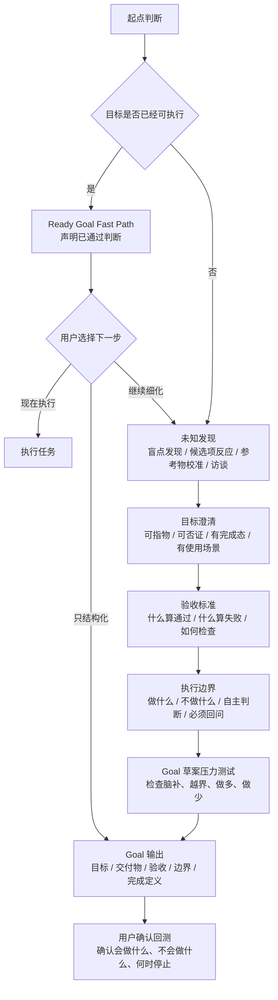

# goal-clarifier

把模糊想法澄清成可交给 Agent 执行的目标指令。

适用于 Codex、Claude Code，以及其他支持 `SKILL.md` / system prompt 的 Agent 工作流。

很多时候，模型已经足够强，真正的瓶颈是人还没有把目标说清楚：

- 想做什么说不清
- 什么算完成说不清
- 什么不做说不清
- 哪些地方让 Agent 自主判断说不清
- 哪些情况必须先问用户说不清

`goal-clarifier` 的作用不是帮你把一句话润色得更像 prompt，而是通过交互式澄清，把一团模糊想法压成一条可执行、可验收、有边界的 Agent goal。

作者主页：[Jasper Wei](https://x.com/Jasper_Wei1)


---

## 一眼看懂

| 原始表达 | 经过 goal-clarifier 后 |
| --- | --- |
| 我想让 Agent 帮我整理一下内容系统，但我也不知道要什么 | 明确产出“内容系统设计文档”，包含目录分层、状态流转、命名规则和非目标 |
| 帮我把这个项目做得更专业 | 明确是补 README、安装说明和使用示例，不改核心代码 |
| 我想写一个产品方案，但不知道什么算好 | 先选择“判断型 / 执行型 / 销售型 / 需求型”方案，再定义验收标准 |
| 我想把这段需求交给 Codex 执行 | 输出带 Goal、Deliverable、Acceptance Criteria、Execution Boundaries 的结构化 goal |

---

## 这个 Skill 解决什么问题

它专门处理这类输入：

```text
我想做一个内容系统，但不知道从哪里开始。
我想让 Agent 帮我优化这个项目，但我说不清楚优化什么。
我有个想法，想先让 Agent 帮我拆清楚。
我知道自己不满意，但不知道最终要什么结果。
我想把这个需求整理成适合 Codex / Claude Code 执行的 goal。
```

它最终会帮你得到：

- 明确目标：到底要 Agent 完成什么
- 验收标准：什么结果算通过，什么结果算失败
- 执行边界：做什么，不做什么，做到哪里停
- 非目标：本轮明确不处理的事项
- 未知处理：遇到小未知怎么保守判断，遇到大未知什么时候回问
- 可复制 goal：可以直接交给 Codex / Claude Code / 其他 Agent 执行

---

## 核心方法

`goal-clarifier` 不是次数驱动，而是标准驱动。

它不会因为“问了几轮”就草草结束。只有当目标、验收标准和执行边界都足够清楚时，才输出最终 goal。

如果用户的请求已经足够清楚，它也不会为了“显得在澄清”而强行追问。它会先明确判断：

```text
这条 goal 已经具备目标、交付物和边界，可以跳过完整澄清流程。
```

然后询问用户下一步：

```text
你希望我现在执行，还是只把它整理成结构化 goal，或者继续细化？
```

少问问题不代表 skill 没有发挥作用，而是说明这条请求已经通过了 ready-goal 检查。通过检查不等于自动执行，仍然需要用户确认。

如果用户连目标都说不出来，它不会继续逼问“你到底要什么”，而是先做未知发现：

```text
盲点发现：你可能缺的是目标、标准、路径、边界、偏好，还是领域地图？
候选项反应：给出几个可能方向，让你判断哪个更接近、哪个明确不要。
参考物校准：给出几种交付物形态，让你看见“什么算好”。
一问一答访谈：只问会改变目标结构的关键问题。
```

如果用户能说出一个模糊目标，它会进入目标审计：

```text
可指物：完成后能指着什么说“就是这个”？
可否证：什么情况算没做到？
有完成态：Agent 做到哪里应该停？
有使用场景：结果拿来做什么？
```

---

## 工作流程

`goal-clarifier` 的主流程可以理解成 6 层：

```text
起点判断 -> 未知发现 -> 目标澄清 -> 验收标准 -> 执行边界 -> Goal 输出
```



最终输出格式大致是：

```markdown
# Agent Goal

## Goal
{一句话目标}

## Context
{背景、材料、使用场景}

## Deliverable
{具体交付物}

## Acceptance Criteria
- [ ] {可检查标准 1}
- [ ] {可检查标准 2}
- [ ] Failure condition: {失败条件}

## Execution Boundaries
- Scope: {范围边界}
- Depth: {深度边界}
- Permissions: {权限边界}
- Judgment: {判断边界}

## Non-goals
- {本轮明确不做什么}

## Unknown Handling
- Small unknowns: {小未知如何处理}
- Large unknowns: {大未知何时回问}

## Ask Before Doing
- {必须先问用户的情况}

## Completion Definition
The goal is complete when {完成定义}.
```

---

## 如何安装

### 通用安装方式（适用于 Codex / Claude Code）

使用 `skills` CLI 一键安装：

```bash
npx -y skills add Jasper-Wei1/goal-clarifier -g --all
```

这条命令需要本机可用 `node` / `npx`。

安装后，在 Codex 中可以使用：

```text
$goal-clarifier
```

在 Claude Code 中可以使用：

```text
/goal-clarifier
```

如果你的 Agent 支持 `SKILL.md`，也可以把本仓库作为普通 skill 源使用。核心文件是：

```text
SKILL.md
agents/openai.yaml
```

其中 `SKILL.md` 是主要能力文件，`agents/openai.yaml` 是 Codex UI 元数据。

---

## 如何更新

重新运行安装命令即可更新到仓库最新版本：

```bash
npx -y skills add Jasper-Wei1/goal-clarifier -g --all
```

如果你是在项目中手动复制 `SKILL.md`，重新复制最新版本即可。

---

## 使用示例

### 示例 1：从“我也说不清”到可执行 goal

```text
$goal-clarifier

我想让 Agent 帮我整理我的自媒体工作流，但我不知道最终应该让它产出什么。
我现在就是觉得很乱。
```

`goal-clarifier` 不会直接开始设计系统。它会先判断：你现在不是“目标没写好”，而是还不知道自己缺哪类信息。

它可能会这样引导：

```text
你现在可能有几类未知：

A. 目标未知：不知道最后要拿到什么
B. 标准未知：不知道什么样的整理算好
C. 路径未知：不知道先诊断、设计结构，还是迁移文件
D. 边界未知：不知道这次哪些内容不该动

从你的描述看，最可能是 A + C。
我先给你几个候选方向，你不用选最终答案，只要告诉我哪个更接近、哪个明确不是。
```

然后给出候选项：

```text
候选目标：

A. 诊断型：
让 Agent 检查你现有工作流哪里混乱，并输出问题清单和优先级。

B. 架构型：
让 Agent 设计一套新的内容系统目录、状态流转和使用规则。

C. 迁移型：
让 Agent 直接把现有材料移动到新结构里。

D. SOP 型：
让 Agent 写一套每天怎么选题、写稿、发布、复盘的执行流程。

你先回答：
1. 哪个最接近？
2. 哪个本轮明确不要？
3. 最接近的那个要改哪里？
```

用户可能回答：

```text
B 比较接近，但我现在不想直接迁移文件。
我想先知道应该怎么分层，最好能以后长期用。
```

这时 skill 会把用户的反应转成边界：

```text
已确认：
- 更接近架构型目标
- 本轮不做文件迁移
- 目标不是一次性整理，而是长期可用的内容系统结构

下一步我需要校准交付物形态。你更想要哪一种？

A. 目录结构图 + 每个文件夹用途
B. 工作流说明 + 内容状态流转
C. Notion/Obsidian 数据库字段设计
D. 一份可直接交给另一个 Agent 执行的搭建 goal
```

用户继续选择后，最终会被压成一条 goal：

```markdown
## Goal
请基于我当前的自媒体工作流，设计一套长期可维护的内容系统结构，用于后续选题、写稿、发布和复盘。

## Deliverable
一份内容系统设计文档，包含目录分层、每层用途、内容状态流转、命名规则和后续搭建建议。

## Acceptance Criteria
- [ ] 明确区分选题、草稿、发布、复盘、素材库等模块
- [ ] 每个模块说明用途、输入、输出和维护规则
- [ ] 给出一条从“选题进入”到“发布复盘”的完整流转路径
- [ ] Failure condition: 只给抽象原则、没有具体结构和使用规则，则视为未完成

## Execution Boundaries
- Scope: 只设计系统结构和规则
- Depth: 做到方案设计，不做实际文件迁移
- Judgment: Agent 可以提出命名和分层建议

## Non-goals
- 本轮不移动现有文件
- 本轮不设计商业模式
- 本轮不写具体内容稿件

## Ask Before Doing
- 如果需要删除、合并或重命名已有关键目录，必须先问用户

## Completion Definition
当设计文档足以让另一个 Agent 或用户开始搭建内容系统时，本 goal 完成。
```

这个例子体现的是：用户一开始并不知道自己要什么，但可以通过“候选项反应”和“参考物校准”，逐步发现目标。

### 示例 2：已有目标但不清楚

```text
$goal-clarifier

帮我把这个项目做得更专业。
```

它会检查“更专业”这个词是否在空转，并追问：

- 做完后能指着什么说完成？
- 什么情况算没做到？
- Agent 应该改代码、写文档、做审查，还是只给建议？
- 不允许它改哪些东西？

可能的澄清过程：

```text
“更专业”现在还不能执行。它可能指：

A. 代码更专业：修复结构、类型、测试、错误处理
B. 产品更专业：优化页面、流程、文案和状态反馈
C. 文档更专业：补 README、架构说明、使用指南
D. 发布更专业：补安装、CI、版本说明和示例

你说的更专业更接近哪一种？
```

如果用户回答：

```text
更接近文档和发布，不要动核心代码。
```

skill 就会把“更专业”翻译成可检查条件：

```text
验收标准可以变成：
- README 能让新用户知道这个项目解决什么问题
- 有一条可复制的安装命令
- 有 2-3 个具体使用示例
- 明确说明不适合什么场景
- 不改核心代码
```

### 示例 3：不知道什么算好

```text
$goal-clarifier

我想让 Agent 帮我写一个产品方案，但我不知道一个好的产品方案应该长什么样。
```

这时问题不是目标完全没有，而是“验收标准未知”。skill 会先给参考物：

```text
产品方案可以有几种形态：

A. 判断型：这个产品值不值得做
输出：结论、用户、痛点、风险、下一步验证

B. 执行型：怎么把产品做出来
输出：目标、功能范围、里程碑、资源、风险

C. 销售型：怎么把产品卖出去
输出：目标客户、购买理由、定价、渠道、话术

D. 需求型：交给开发实现
输出：用户故事、功能清单、验收标准、边界

你更想要哪一种？哪一种明确不是？
```

用户通过选择参考物，才能进一步定义“什么算好”。这对应 Claude 文章里提到的情况：有些标准不是用户一开始就能说出来，而是看到候选形态后才知道“对 / 不对”。

### 示例 4：准备交给 Agent 执行

```text
$goal-clarifier

我想把这段需求整理成可以交给 Codex 执行的 goal。
```

它会输出一份结构化 goal，包含目标、交付物、验收标准、执行边界、非目标和回问条件。

### 示例 5：已经足够清楚，进入 Ready Goal Fast Path

```text
$goal-clarifier

参考 dontbesilent2025/dbskill 的 README 风格，为当前项目写一份中文版 README，重点说明这个 skill 解决什么问题、如何安装、如何使用。
```

这条请求已经具备：

- 目标：写中文版 README
- 对象：当前项目
- 参考物：dontbesilent2025/dbskill
- 交付物：README
- 边界：中文版，重点写问题、安装、使用

所以 skill 不会强行追问，而会先判断：

```text
这条 goal 已经具备目标、交付物和边界，可以跳过完整澄清流程。

你希望我现在执行，还是只把它整理成结构化 goal，或者继续细化？
```

只有在用户确认“现在执行”后，它才会开始写文件。少问问题不代表 skill 没发挥作用，而是说明它判断这条请求已经可执行；但是否执行，仍然由用户决定。

---

## 不适合什么场景

这个 skill 不负责直接执行复杂任务。

它更像目标成型前的“澄清层”。当目标已经清楚时，你应该把生成的 goal 交给 Codex、Claude Code 或其他执行型 Agent。

它也不会替用户做重大决策。遇到会改变目标、验收标准或执行边界的问题，它会要求先确认，而不是擅自决定。

---

## 设计原则

### 1. 不把头脑风暴当终点

头脑风暴只负责把用户的未知变成可反应材料。最终仍然要压成目标、验收和边界。

### 2. 不要求用户一开始就说清楚

很多人不是不愿意说清楚，而是还没有足够的表达材料。这个 skill 会先提供候选项、参考形态和低成本草案。

### 3. 不用高级词掩盖模糊

“专业、完整、系统、可落地、有价值”都必须被翻译成可检查条件。

### 4. 不让 Agent 无限扩张任务

边界和非目标是 goal 的一部分，不是补充说明。

---

## 参考与方法来源

`goal-clarifier` 的设计主要参考了两类方法。

### 1. dbs-goal：目标语言空转检测

来源：[dontbesilent2025/dbskill](https://github.com/dontbesilent2025/dbskill)

本项目吸收了 `dbs-goal` 的核心判断：

> 很多目标看起来像目标，但既不能确定下一步行动，也不能识别完成。

`dbs-goal` 中的三个测试被保留下来，并作为目标澄清阶段的基础标准：

- 可指物：完成后能指着什么说“就是这个”
- 可否证：什么情况算没做到
- 有完成态：做到哪里算结束

`goal-clarifier` 在此基础上进一步面向 Agent goal 模式，补充了：

- 验收标准
- 执行边界
- 非目标
- Unknown Handling
- Ask Before Doing
- Completion Definition

也就是说，`dbs-goal` 解决的是“这句话配不配叫目标”，`goal-clarifier` 进一步解决“这句话能不能交给 Agent 执行”。

### 2. Claude Fable：Finding your unknowns

本项目还参考了 Anthropic 的文章：

[A field guide to Claude Fable: Finding your unknowns](https://claude.com/blog/a-field-guide-to-claude-fable-finding-your-unknowns)

这篇文章对本项目最大的启发是：

> 用户经常不是不愿意说清楚，而是不知道自己还不知道什么。

因此，`goal-clarifier` 在正式目标审计前加入了“未知发现”阶段：

- 盲点发现：帮助用户识别自己缺的是目标、标准、路径、边界、偏好还是领域地图
- 候选项反应：给出几个可能方向，让用户通过“接近 / 不要 / 改一半”来表达
- 参考物校准：当用户不知道什么算好时，先给他看几种交付物形态
- 草案压力测试：在最终输出前检查另一个 Agent 执行时会在哪里脑补、越界或做不够

这让 `goal-clarifier` 不只适用于“用户已经能说出一个模糊目标”的情况，也适用于“用户只有一团感觉，还没有可输入目标”的情况。

---

## 文件结构

```text
goal-clarifier/
├── SKILL.md
└── agents/
    └── openai.yaml
```

---

## License

暂未指定 license。使用前请以仓库最新版本为准。
