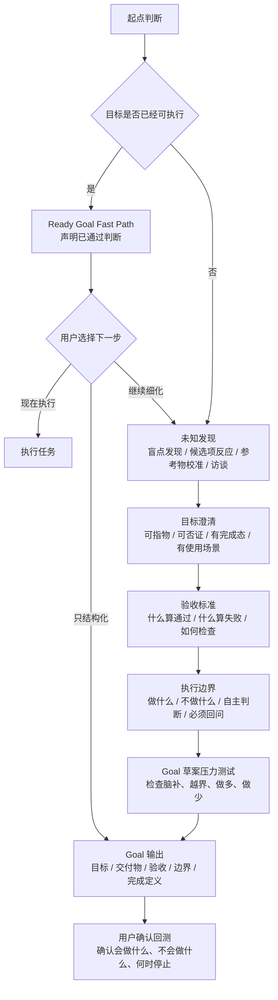

# goal-clarifier

[中文说明](README.md) / [English README](README.en.md)

把模糊想法澄清成可交给 Agent 执行的目标指令。

适用于 Codex、Claude Code，以及其他支持 `SKILL.md` / system prompt 的 Agent 工作流。

很多时候，模型已经足够强，真正的瓶颈是人还没有把目标说清楚：想做什么、什么算完成、哪些不做、哪些地方 Agent 可以自主判断、哪些情况必须先问用户。

`goal-clarifier` 不是 prompt 美化工具，而是一个目标澄清层：通过盲点发现、候选项反应、参考物校准和目标审计，把一团模糊想法压成可执行、可验收、有边界的 Agent goal。

作者主页：[Jasper Wei](https://x.com/Jasper_Wei1)

---

## 如何安装

### 通用安装方式（适用于 Codex / Claude Code）

```bash
npx -y skills add Jasper-Wei1/goal-clarifier -g --all
```

这条命令需要本机可用 `node` / `npx`。

安装后，在 Codex 中可以使用：

```text
$goal-clarifier
```

在 Claude Code 中可以使用：

```text
/goal-clarifier
```

## 如何更新

重新运行安装命令即可更新到仓库最新版本：

```bash
npx -y skills add Jasper-Wei1/goal-clarifier -g --all
```

---

## 一眼看懂

| 原始表达 | 经过 goal-clarifier 后 |
| --- | --- |
| 我想让 Agent 帮我整理内容系统，但我也不知道要什么 | 明确产出“内容系统设计文档”，包含目录分层、状态流转、命名规则和非目标 |
| 帮我把这个项目做得更专业 | 明确是补 README、安装说明和使用示例，不改核心代码 |
| 我想写一个产品方案，但不知道什么算好 | 先选择“判断型 / 执行型 / 销售型 / 需求型”方案，再定义验收标准 |
| 我想把这段需求交给 Codex 执行 | 输出带 Goal、Deliverable、Acceptance Criteria、Execution Boundaries 的结构化 goal |

---

## 核心方法

### 1. 先判断目标是否已经可执行

如果用户的请求已经具备目标、交付物和边界，skill 不会为了“显得在澄清”而强行追问。它会先判断：

```text
这条 goal 已经具备目标、交付物和边界，可以跳过完整澄清流程。
```

然后询问用户下一步：

```text
你希望我现在执行，还是只把它整理成结构化 goal，或者继续细化？
```

通过 ready-goal 检查不等于自动执行，仍然需要用户确认。

### 2. 如果用户说不出目标，先发现未知

当用户只有一团感觉时，不继续逼问“你到底要什么”，而是先帮他发现未知：

```text
盲点发现：你可能缺的是目标、标准、路径、边界、偏好，还是领域地图？
候选项反应：给出几个可能方向，让你判断哪个更接近、哪个明确不要。
参考物校准：给出几种交付物形态，让你看见“什么算好”。
一问一答访谈：只问会改变目标结构的关键问题。
```

### 3. 如果用户能说出模糊目标，进入目标审计

```text
可指物：完成后能指着什么说“就是这个”？
可否证：什么情况算没做到？
有完成态：Agent 做到哪里应该停？
有使用场景：结果拿来做什么？
```

### 4. 最终压成结构化 goal

最终输出包含：

- Goal
- Context
- Deliverable
- Acceptance Criteria
- Execution Boundaries
- Non-goals
- Unknown Handling
- Ask Before Doing
- Completion Definition

---

## 工作流程

```text
起点判断 -> 未知发现 -> 目标澄清 -> 验收标准 -> 执行边界 -> Goal 输出
```



---

## 使用示例

### 示例 1：用户只有模糊感觉

```text
$goal-clarifier

我想让 Agent 帮我整理我的自媒体工作流，但我不知道最终应该让它产出什么。
我现在就是觉得很乱。
```

skill 会先做未知发现，而不是直接设计系统：

```text
你现在可能缺的是：
A. 目标：不知道最后要拿到什么
B. 标准：不知道什么样的整理算好
C. 路径：不知道先诊断、设计结构，还是迁移文件
D. 边界：不知道这次哪些内容不该动

我先给你几个候选方向：诊断型 / 架构型 / 迁移型 / SOP 型。
你只需要告诉我哪个更接近、哪个明确不要。
```

### 示例 2：用户有模糊词

```text
$goal-clarifier

帮我把这个项目做得更专业。
```

skill 会把“更专业”拆成可反应选项：

```text
更专业可能指：
A. 代码更专业：结构、类型、测试、错误处理
B. 产品更专业：流程、文案、状态反馈
C. 文档更专业：README、架构说明、使用指南
D. 发布更专业：安装、CI、版本说明、示例
```

用户选择后，再转成可检查验收标准。

### 示例 3：目标已经清楚

```text
$goal-clarifier

参考 dontbesilent2025/dbskill 的 README 风格，为当前项目写一份中文版 README，重点说明这个 skill 解决什么问题、如何安装、如何使用。
```

skill 会判断这条 goal 已经具备目标、交付物和边界，然后询问：

```text
你希望我现在执行，还是只把它整理成结构化 goal，或者继续细化？
```

只有用户确认“现在执行”后，才会开始执行。

---

## 不适合什么场景

这个 skill 不主要负责直接执行复杂任务。它更像目标成型前的“澄清层”。当目标已经清楚时，你应该把生成的 goal 交给 Codex、Claude Code 或其他执行型 Agent。

它也不会替用户做重大决策。遇到会改变目标、验收标准或执行边界的问题，它会要求先确认。

---

## 参考与方法来源

### dbs-goal：目标语言空转检测

来源：[dontbesilent2025/dbskill](https://github.com/dontbesilent2025/dbskill)

`goal-clarifier` 保留了 `dbs-goal` 的三个基础测试：

- 可指物
- 可否证
- 有完成态

并进一步面向 Agent goal 模式补充：验收标准、执行边界、非目标、Unknown Handling、Ask Before Doing、Completion Definition。

### Claude Fable：Finding your unknowns

参考：[A field guide to Claude Fable: Finding your unknowns](https://claude.com/blog/a-field-guide-to-claude-fable-finding-your-unknowns)

这篇文章对本项目最大的启发是：用户经常不是不愿意说清楚，而是不知道自己还不知道什么。因此，本 skill 在正式目标审计前加入了盲点发现、候选项反应、参考物校准和草案压力测试。

---

## 文件结构

```text
goal-clarifier/
├── SKILL.md
├── README.md
├── README.en.md
├── LICENSE
└── agents/
    └── openai.yaml
```

---

## License

MIT License. See [LICENSE](LICENSE).
